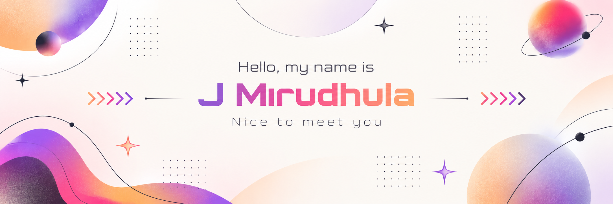

# MRIDHU

### Full-Stack Developer · AI Systems Builder · Creative Technologist

 

&nbsp;

&nbsp;

&nbsp;

---

## 🧠 ABOUT ME

I'm a **B.Tech Computer Science student** who enjoys building software, experimenting with new technologies, and turning ideas into working systems.

My interests sit at the intersection of:

`Full-Stack Development` · `AI` · `Agentic Systems` · `Backend Engineering` · `Cloud` · `DevOps` · `Distributed Systems` · `Automation`

### CONCEPT → ARCHITECTURE → CODE → DATABASE → API → DEPLOYMENT → PRODUCTION

> Building things is how I learn.

---

## ⚡ WHAT I BUILD

<table width="100%">
<tr>

<td width="58%" valign="top">

<table width="100%">
<tr>

<td width="50%" valign="top">

### 🌐 Full-Stack Applications

Web applications with real functionality, authentication, APIs, databases, dashboards and production-ready deployment.

</td>

<td width="50%" valign="top">

### 🤖 AI-Powered Products

LLM applications, intelligent interfaces, AI-assisted workflows and agentic systems.

</td>

</tr>

<tr>

<td width="50%" valign="top">

### ⚙️ Backend & API Systems

APIs, databases, authentication, service architecture and automation.

</td>

<td width="50%" valign="top">

### 🧪 Experimental Projects

Projects combining software, hardware, AI and emerging technologies.

</td>

</tr>
</table>

</td>

<td width="42%" align="center" valign="middle">

</td>

</tr>
</table>

---

## 💻 TECH STACK

---

## 📊 GITHUB ACTIVITY

---

## 📈 GITHUB STATS

 

---

## 🏆 ACHIEVEMENTS

---

## 🌌 BEYOND THE CODE

`THREE.JS` · `GSAP` · `3D WEB` · `WHIMSICAL WEBSITES`

`INTERACTIVE EXPERIENCES` · `CREATIVE UI/UX` · `HARDWARE + SOFTWARE`

 

The goal isn't just to make things work.

### It's to make them **interesting to use.**

---

## ⚙️ BUILDING IN PUBLIC

### LEARN → BUILD → BREAK → DEBUG → IMPROVE → SHIP

I'm documenting the journey through projects, experiments and continuous iteration.

---

## 🤝 LET'S CONNECT

 

<i>Building, learning and exploring, one project at a time.</i>

---

### BUILT WITH CURIOSITY · IMPROVED THROUGH ITERATION

© 2026 Mirudhula · Building one system at a time.

